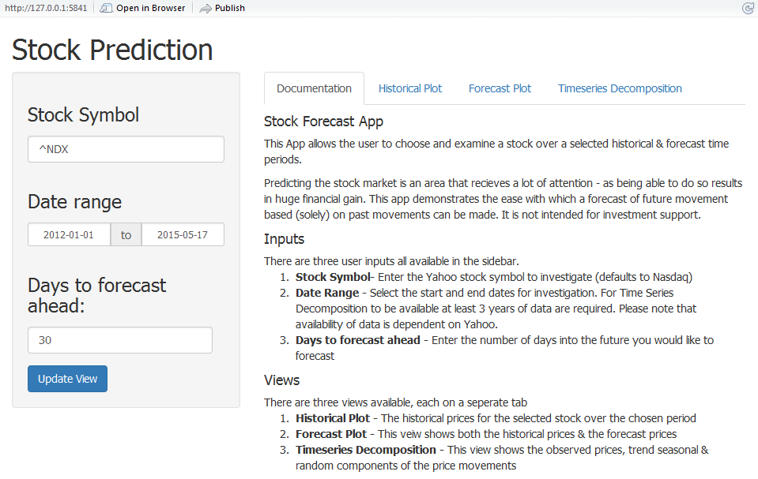
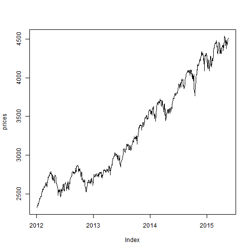
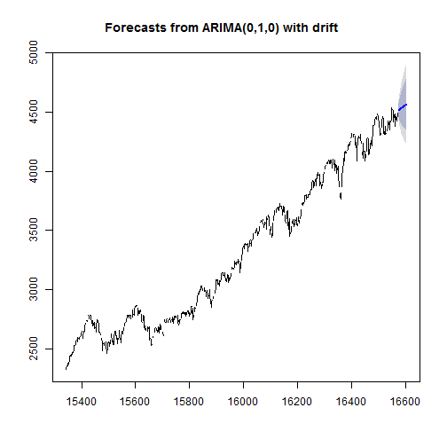
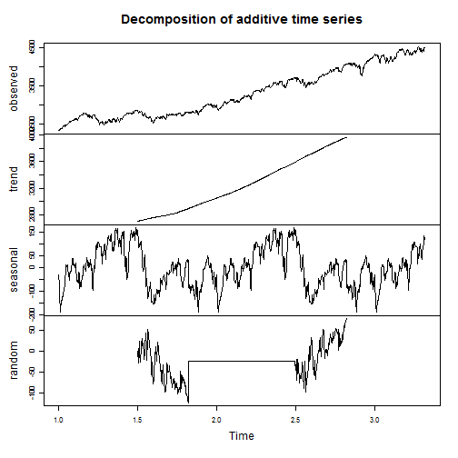

Stock Forecast miniApp Presentation
========================================================
author: 
date: Tue May 19 20:48:09 2015
transition: rotate


The App!
========================================================



Historical View
========================================================

```
time series starts 2012-01-03
time series ends   2015-05-18
```

 
***
- The financial information is taken from yahoo. 
- Where missing values existed in the data they have been replaced with the most recent existing price.

Forecast View
========================================================

 
***
The forecast view is constructed using the `auto.arima()` function which selects the best autoregressive integrated moving average (ARIMA) model to the timeseries

Timeseries Decomposition
========================================================

 
***
- The time series decomposition shows the data broken down into 3 seperate components: Seasonal, trend and irregular using moving averages.
- The time series decomposition requires at least 3 years worth of data to calculate. 
